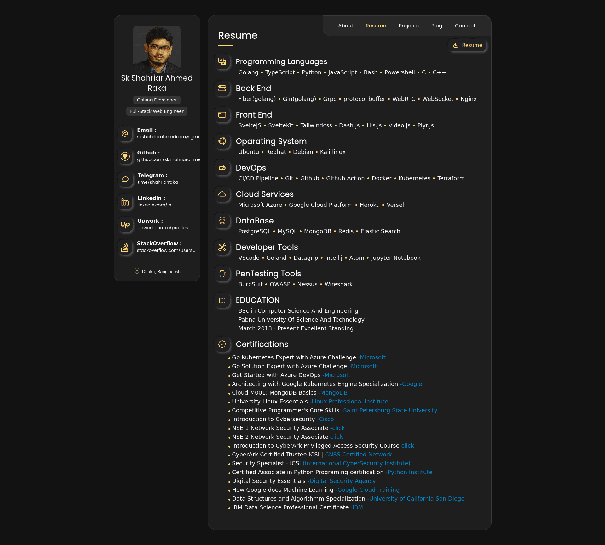
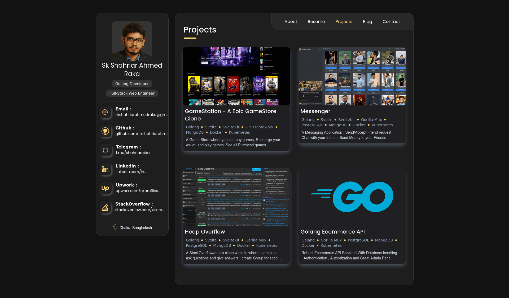
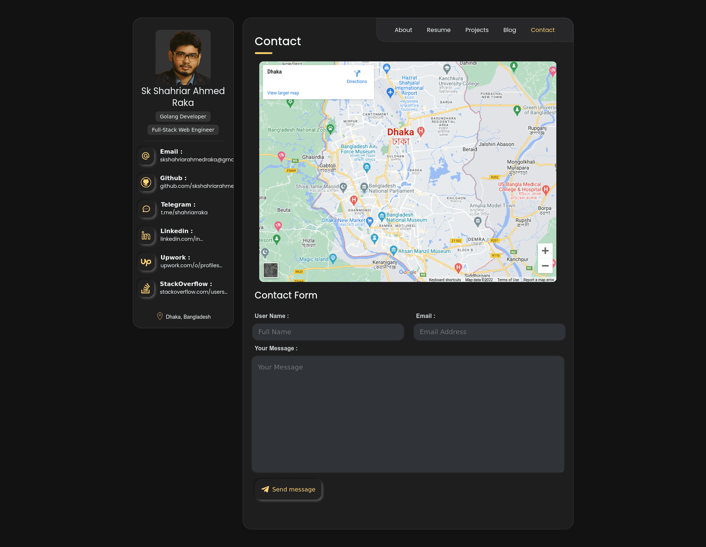

## My Portfolio Site

[www.shahriarraka.me/](https://www.shahriarraka.me/ "https://www.shahriarraka.me/")

Used Technologies : Svelte , Sveltekit , Tailwindcss

### About me


### Resume



### Projects



### Blogs


### Aboutme



# 

## Run This project

go to the root directory of this project , install necessary packages

```bash
npm install
```

#### run in development mode

```bash
npm run dev

# or start the server and open the app in a new browser tab
npm run dev -- --open
```
